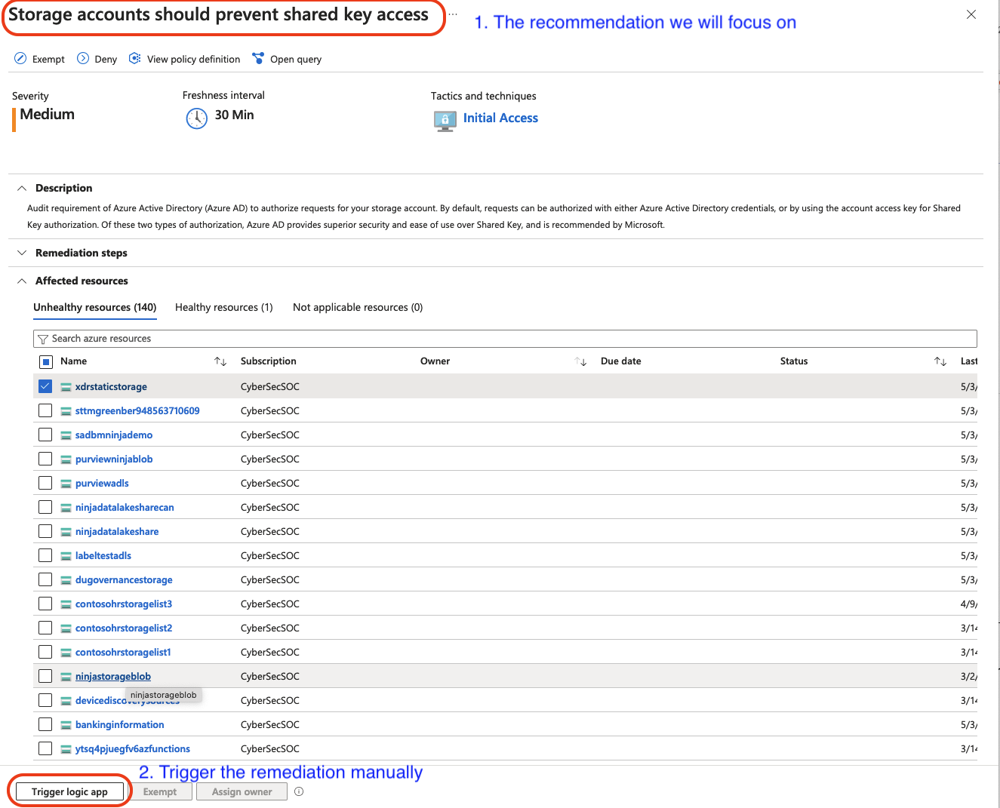

# Module 1 - Response Triggers

You can respond to *recommendations, alerts,* and, *compliance findings*

The response is orchestrated using **Logic Apps** (we will build one in Module 2).

You can trigger the response logic app either automatically or manually.

**Triggering the flow:**
1. In case you want to set up the **automated response**, you will need to set up *Workflow Automation* to trigger the logic app when Defender for Cloud detects the finding. The procedure for setting up the *Workflow Automation* is [here](https://learn.microsoft.com/en-us/azure/defender-for-cloud/workflow-automation). **Note** that you can use Azure Policies to set up the automation at [scale](https://learn.microsoft.com/en-us/azure/defender-for-cloud/workflow-automation#configure-workflow-automation-at-scale) but we will not cover them as part of this workshop.
   
   **Some use cases for Automated Trigger**:
   * You have strict policy guidelines and want to maintain the risk at acceptable level with **no exceptions**
   * You have already triaged the trigger, determined that there are no risk exceptions, and want to remediate as soon as the risk arises
   * The risk posed is far beyond what your tolerance levels 
2. You can also trigger responses **manually** after investigating the findings.

   **Some use cases for manually triggering the response**:
   * You are early in the deployment stages
   * You want to remediate only handful of the unhealthy resources and will set exception for the remaining
   * The change management system is not directly linked with Logic Apps to trigger an automatic deployment

 
The image below shows what the workshop will focus on and how to trigger manual remediation flow.
  

Let's see how to [write](./Module%202%20-%20Writing%20Logic%20App.md) the response logic app