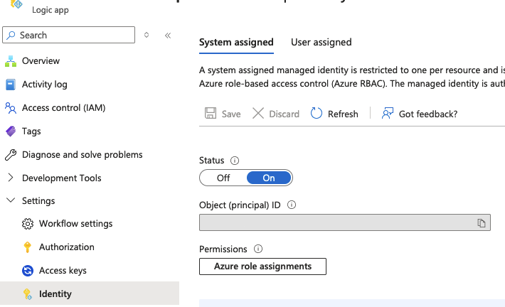
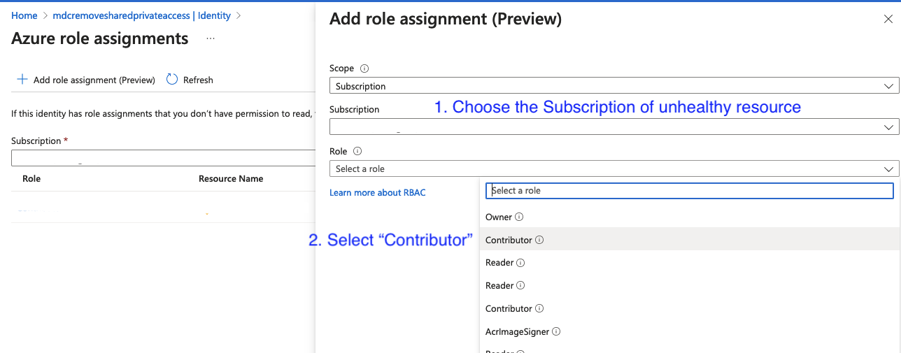
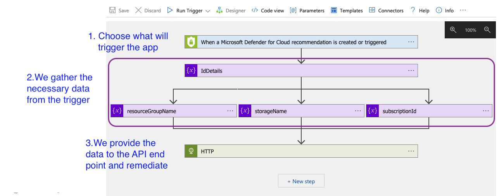
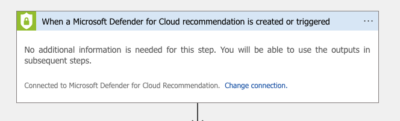
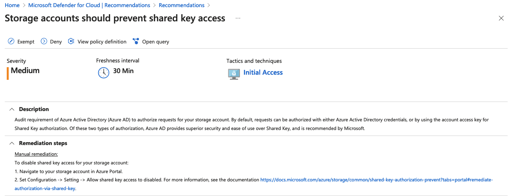
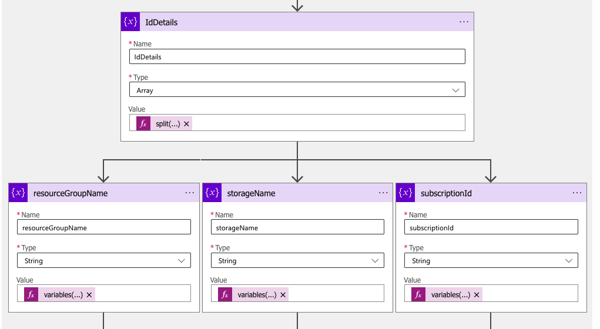
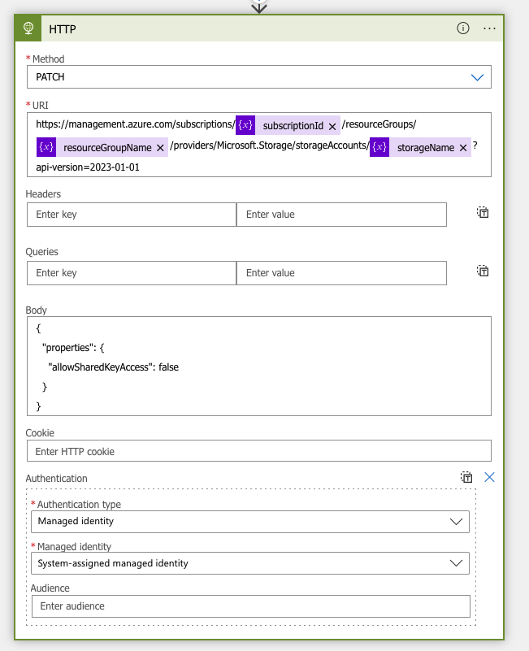

# Module 2 - Writing the Logic App

## Deploying / creating the app
Click on the **Deploy to Azure** button to create the Logic App in a target resource group.

We will also need to create a managed identity for this app. The remediation will require the permissions associated with this managed identity. Since this is testing environment we will give "Contributor" permissions to this identity

**To assign Managed Identity to specific scope:**

1. Make sure you have Owner / Contributor permissions for this scope.
2. Go to the Settings.
3. Press 'Identity' on the navigation bar.
4. Choose 'System assigned' and set Status to 'On'.      
5. Set the 'Permissions' by clicking 'Azure role assignments' and choosing the subscription as your scope and then selecting the susbcription of unhealthy resource and then selecting 'Contributor' under role.     
6. Click "Save" at the bottom of the page.

## Walkthrough of the logic app

The logic app we deployed should look like this:
   

Let's go through each step:

**Step 1 - Setting the trigger**

Since we using Defender for Cloud as a trigger, the logic app will create a connection to get the necessary data. This is done automatically.

**Step 2 - Getting the necessary data**

Based on the remediation steps mentioned in the recommendation *"Storage accounts should prevent shared key access"*  
   
We see that we will need - Storage Account Name, Resource Group, and Subscription ID to run the necessary API call.

In this step we logic app functions to get the necessary variables from the trigger schema like so:

**Step 3 - Perform the remediation**

We use the Storage REST API [endpoint](https://learn.microsoft.com/en-us/rest/api/storagerp/storage-accounts/update?view=rest-storagerp-2023-01-01&tabs=HTTP) to perform the remediation.

Important point here is to make sure that you use the managed identity we created for the logic app above. Without this the Logic App will not have necessary permissions to make the changes. 
You also can see how we are using the variables from Step 2 above.
    

## Conclusion

In this module we saw how to create a Logic App for specific recommendation and configure it to perform the remediation based on the steps mentioned in the Recommendation.

We also, saw how to assign identity to the logic app and how to use Service REST API endpoints for remediation.

## Next steps

Once ready let's look at how you can [connect](./Module%203%20-%20Remediation%20options.md) this logic app to a recommendation

You want to review the [available trigger options](./Module%201%20-%20Recommendation%20triggers.md)