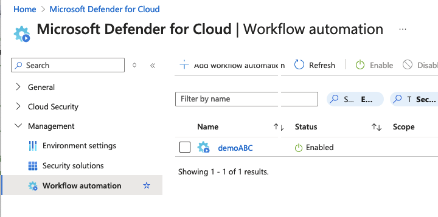
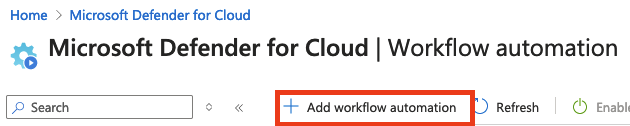
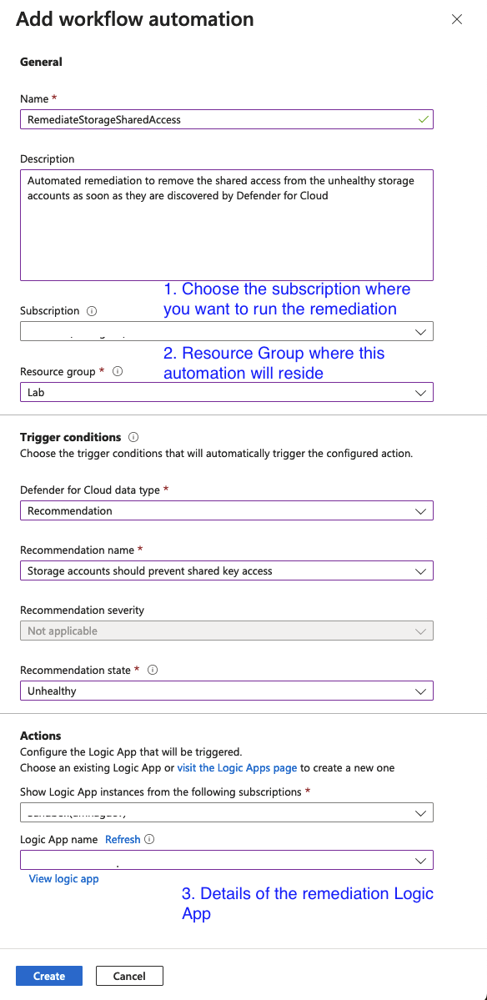
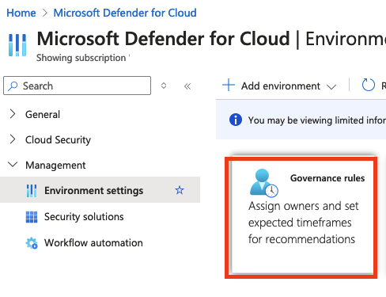
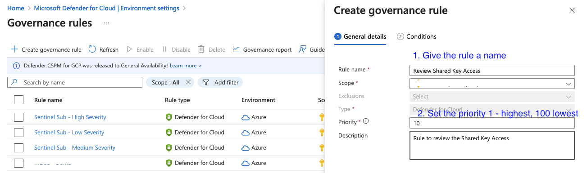
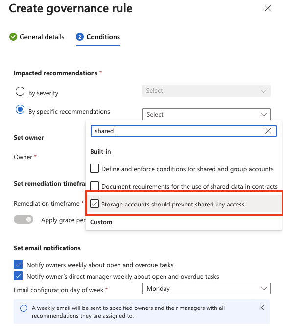
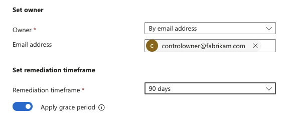

# Module 3 - Remediation options

So far the capabilities we have discussed apply to both Azure Sentinel and Defender for Cloud. This section, however, is more geared towards the out of the box capabilities that Defender for Cloud have. 

If you are interested in conducting the same in Sentinel, please let the workshop instructor know and they probably can have a follow up.

## Setting up automated remediation

Defender for cloud has *"Workflow Automation"* option that we will use run our Logic App automatically. We discussed this in [Module 1](./Module%201%20-%20Recommendation%20triggers.md).
    
Let's set that up.

From the *Workflow Automation* screen select **Add workflow automation**.     

The menu shown below will pop up  
  

Fill in the details as show in the picture.

Your automation will trigger whenever the recommendation appears.

At this point it will be a good idea to review the documentation [here](https://learn.microsoft.com/en-us/azure/defender-for-cloud/workflow-automation)

## Manual remediation with Governance

There might be [reasons](./Module%201%20-%20Recommendation%20triggers.md) why you would not want to remediate automatically. 

In such cases, you may want to leverage the *Governance Rules* to forward the alerts to a specific distribution list for review. The control owner can then execute the Logic App after reviewing.
    

When you click on the Governance Rules as shown in picture above, you will get an option like so:
    

> Important to note that rules are executed in the priority order (1 - Highest; 100 - Lowest) so you can build a hierarchy. 

Click **Next** at the bottom of the page. 

Select our recommendation as we are only interested in one specific use case here, like so:
   

We will also need to set the **Owner** which will be our control owner. Then choose how soon you want the remediation to be resolved by selecting the **Remediation timeframe** like so:
    

Once you hit **Create** at the bottom of the page, the rule will be live and the control owner will get email.

The Control Owner can now review the recommendation in the Defender Portal and then execute the remediation on appropriate "unhealthy" resources as shown in [Module 1](./Module%201%20-%20Recommendation%20triggers.md)

## Next steps

Review the Workflow Automation [documentation](https://learn.microsoft.com/en-us/azure/defender-for-cloud/workflow-automation) 

Review [Governance Rules](https://learn.microsoft.com/en-us/azure/defender-for-cloud/episode-fifteen)

At this point, you might be wondering what if I want to run remediation flows on all existing "unhealthy" resources asap. There is another option to perform this [bulk remediation](./Module%204%20-%20Bulk%20remediation.md)

If you want to review the Logic App click [here](./Module%202%20-%20Writing%20Logic%20App.md)