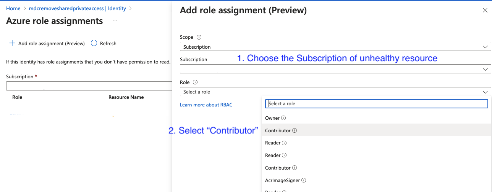
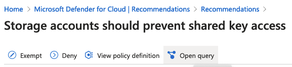
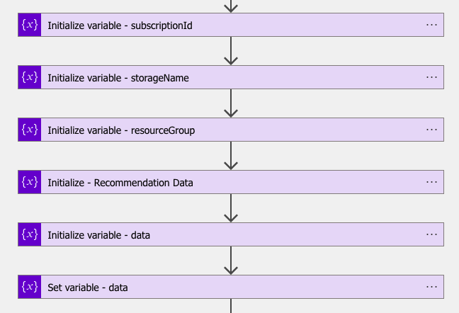

# Module 4 - Bulk remediation

In this module we will look at another way to remediate. Here will not use the triggers that Defender for Cloud provides or the governance flow.

We will get results directly from Azure Resource Graph and build the remediation based on that query.

## Deploying the Logic App
Click on the **Deploy to Azure** button to create the Logic App in a target resource group.

We will also need to create a managed identity for this app. The remediation will require the permissions associated with this managed identity. Since this is testing environment we will give "Contributor" permissions to this identity

**To assign Managed Identity to specific scope:**

1. Make sure you have Owner / Contributor permissions for this scope.
2. Go to the Settings.
3. Press 'Identity' on the navigation bar.
4. Choose 'System assigned' and set Status to 'On'.      
5. Set the 'Permissions' by clicking 'Azure role assignments' and choosing the subscription as your scope and then selecting the susbcription of unhealthy resource and then selecting 'Contributor' under role.     
6. Click "Save" at the bottom of the page.

>It is important to note that since we only assigned "Contributor" on a specific subscription, we wil only get the results for that particular subscription when we run the Resource Graph in steps below. Hence the Logic App will only remediate the unhealthy resources in that subscription.

## Logic App Walkthrough

Once deployed the Logic App should look like below:
    

**Step by Step walkthrough**
1. *Querying Azure Resource Graph (ARG)*: We first write the query, but you need to worry about writing it from scratch. Each recommendation has a corresponding query, which you can access from the recommendation page in Defender for Cloud, like so     
Once you click on the **Open query** you will be taken to the ARG from where you can copy the KQL that we will use in next step, like so:
   
2. *Setting up the ARG Query*: We will use HTTP POST to run the ARG query. Note that we are using Managed Identity to do so (Authentication).     
3. *Gathering necessary data*: In this step we parse the query results to extract the variables that we will need for remediation. This is essentially the same as we did in [Module 2](./Module%202%20-%20Writing%20Logic%20App.md)    
4. *Conducting the remediation*: We will have a bunch of unhealthy resources so we will run a loop to remediate each of them individually. Also, take note that we are using a Managed Identity here as well. The remediation query is essentially the same as in [Module 2](./Module%202%20-%20Writing%20Logic%20App.md)    

## Conclusion

You learned how to run remediations based on the results that Defender for Cloud stores in ARG. You can also use this pattern to act on other queryable data in ARG. 
